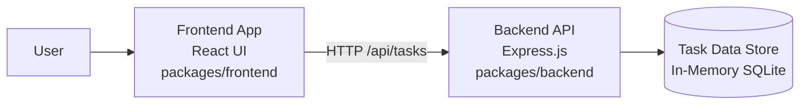
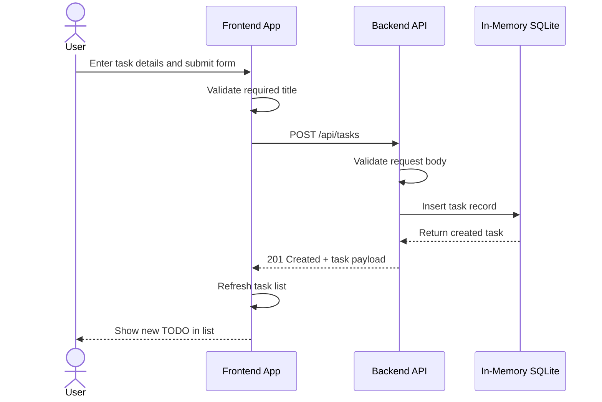

# Cloud Architecture Overview

This monorepo contains a React frontend and a Node.js backend. The frontend provides the user interface for managing tasks, and the backend exposes task APIs backed by an in-memory SQLite database.

## System Context

## Create TODO Sequence

## Monorepo Components

- `packages/frontend`: React application for creating, editing, filtering, and viewing tasks.
- `packages/backend`: Express API that handles task CRUD operations.
- Root workspace: Shared monorepo scripts for running frontend and backend together.

## Current Characteristics

- The frontend and backend are developed and run from the same monorepo.
- The backend currently stores data in an in-memory SQLite database, so task data does not persist across backend restarts.
- The frontend communicates with the backend through the `/api/tasks` endpoints.